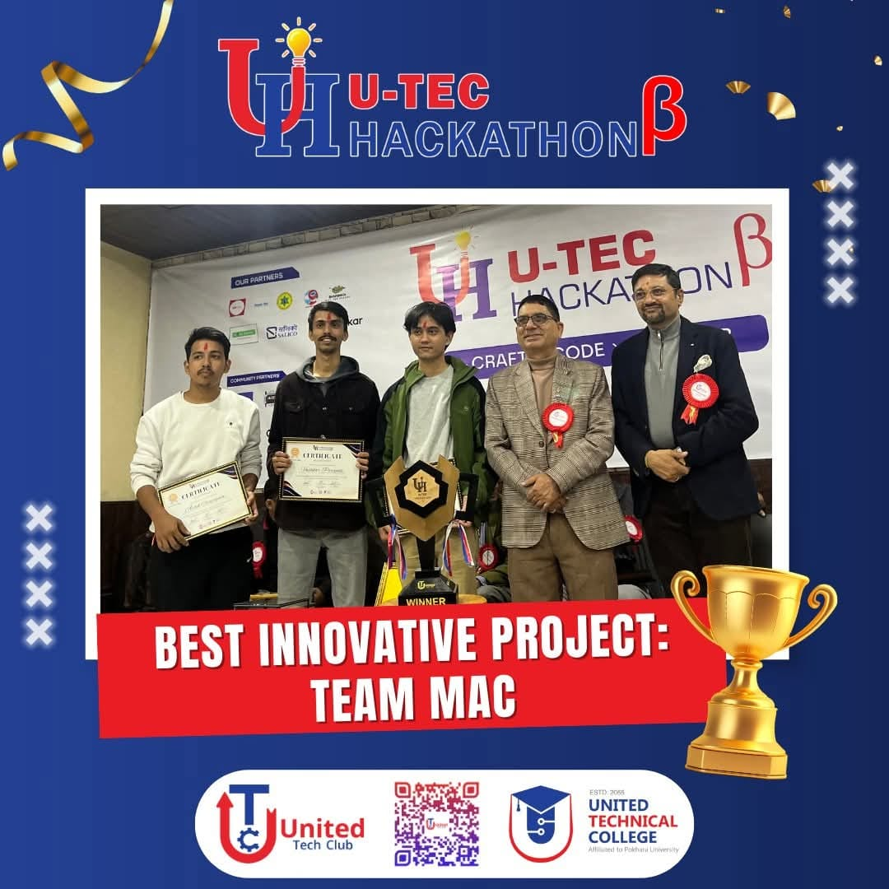

# 🔬 Tuberculosis Bacilli Detector - CellSight
### An IoT-Powered Medical Diagnostic Tool

## 🏆 Recognition
CellSight was awarded "Best Innovative Project" at the United Tech Hackathon ß!

## 🎯 Overview

An innovative medical diagnostic tool that leverages artificial intelligence to detect tuberculosis bacilli in microscope slides. This project combines IoT hardware with advanced machine learning to provide accurate, real-time TB detection in resource-limited settings.

## 🚀 Key Features

### 🤖 Intelligent Detection
- Custom-trained TensorFlow Lite model for accurate bacilli identification
- Real-time processing with offline capability
- Powered by Microsoft's Custom Vision AI

### 📸 Advanced Imaging
- Automated microscope slide imaging system
- Precision camera module with Raspberry Pi integration
- Smart focus and positioning controls

### ☁️ Hybrid Architecture
- **Local Processing:**
  - Offline-first design for reliable operation
  - Local storage and processing capabilities
  - Real-time detection results

- **Cloud Integration:**
  - Azure Blob Storage for image backup
  - PostgreSQL database for results and metadata
  - Secure data synchronization

### 🎛️ Smart Controls
- Intuitive web interface for system control
- Automated slide positioning and focus
- Comprehensive detection workflow management

## 🛠️ Technical Architecture

### Core Components

#### 1. Flask Application
- **Image Processing Pipeline**
  - Real-time capture and analysis
  - TensorFlow Lite integration
  - Results visualization
- **Data Management**
  - Local/cloud storage orchestration
  - Automated backup systems
  - Result tracking and analysis

#### 2. Hardware Control System
- **Arduino-based Automation**
  - Precision stepper motor control
  - Automated focus adjustment
  - Hardware-software communication protocol
- **Camera Module Integration**
  - High-resolution image capture
  - Advanced focus control
  - Real-time preview capability

#### 3. Web Platform
- **[cellsight.co](https://cellsight.co)**
  - Comprehensive documentation
  - Live system monitoring
  - Technical specifications

## 💻 Tech Stack

### Backend & Processing
 &nbsp;
 &nbsp;
 &nbsp;

### Cloud Services
 &nbsp;

### Frontend & Hardware
 &nbsp;
 &nbsp;

## 👥 Collaborators

  <a href="https://github.com/projectashik">
   Ashik Chapagain
  </a>
  &nbsp;&nbsp;&nbsp;&nbsp;
  <a href="https://github.com/roshankcpkr">
   Roshan KC
  </a>
  &nbsp;&nbsp;&nbsp;&nbsp;
  <a href="https://github.com/vaskar10">

   Vaskar
  </a>

